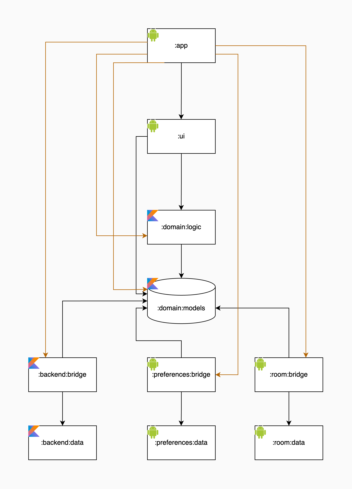

# Modularization

Modularization is an important concept in Android application architecture that involves breaking down an app into smaller,
reusable pieces of code called **modules**.
These modules can be Android libraries, pure Kotlin/Java libraries, multiple app modules, wearable modules, auto modules, etc.
The benefits of modularization include improved scalability, ownership, encapsulation, build times, and strict visibility control.

> [!IMPORTANT]
> To modularize an application, aim for high cohesion and low coupling, which means that each module should have a clear and specific purpose and be as independent as possible regarding other modules. For example, source modules can be completely independent,
but the UI module must depend on the domain module. But no more than that.

Modularization is a way to improve the architecture of an application. It helps to keep the codebase **clean and maintainable**.
It also helps to improve the build time of the application, as well as the compilation time of the modules.

## How to modularize?

An application can be modularized in different ways.
The most common ways are to split the application into feature modules and to split the application into architectural layers.

As a skeleton, we define the **architecture of modules split by layers**.



**Key points:**
* The `app` module orchestrates the overall structure and wires other modules together.
  This module should avoid implementing any logic, except the logic needed to connect the modules.
  As this module needs to depend on almost all the modules in the setup (to connect them), writing additional logic inside could be tempting since everything is easily accessible.
  However, that should be avoided to have a single flow of data in the application.
* The `ui` module is responsible for the user interface.
  This module should depend only on the domain modules to access the data only from the domain.
  By doing that, we can be sure the domain is the only module responsible for managing the data.
* The `domain` module encapsulates the application's core logic.
  This module defines the interfaces needed for it to implement the application logic.
  The other modules in the architecture implement these interfaces.
  The domain module is lightweight because it doesn't have dependencies on other modules.
* The **sources data** modules manage interactions with different data sources.
  The responsibility of these modules is to implement the logic needed to manage the data.
* **Bridge modules** act as intermediaries between the domain and the source data modules.
  They convert the models and API used in the source data modules to the ones used in the domain modules and vice-versa.
  By doing that, both domain and source modules are independent.
* The **common modules** provide shared utility functions and classes,
  either project-specific and shared with multiple modules in the project, or completely project-unrelated.

<details>
<summary><b>Build gradle dependency configuration</b></summary>

_The example contains the Gradle dependency configuration only for the project modules. Any other dependencies, such as libraries or common modules are omitted for the case of simplicity._

***app/build.gradle***

> The root module that connects all of the dependencies together.

```Kotlin
dependencies {
    implementation(project(":ui"))

    implementation(project(":domain:logic"))

    implementation(project(":sources:room:bridge"))
    implementation(project(":sources:backend:bridge"))
    implementation(project(":sources:preferences:bridge"))

    ...
}
```

***ui/build.gradle***

> The UI module uses `:domain:logic` to interface with the entirety of the app logic.

```Kotlin
dependencies {
    implementation(project(":domain:logic"))

    ...
}
```

***domain/models/build.gradle***

> The module which defines interfaces and models used to communicate with other modules.

```Kotlin
dependencies {
    ...
}
```

***domain/logic/build.gradle***

> The module which defines implementation of the application logic.

```Kotlin
dependencies {
    api(project(":domain:models"))

    ...
}
```

***sources/backend/data/build.gradle***

> The module which implements the logic needed to interchange the data with the backend services.

```Kotlin
dependencies {
    ...
}
```

***sources/backend/bridge/build.gradle***

> The module which implements the mapping from the backend data public API (models and functions) to domain public API.

```Kotlin
dependencies {
    implementation(project(":domain:models"))
    implementation(project(":sources:backend:data"))

    ...
}
```

***common/kotlin/build.gradle***

> The module which defines utility functions and classes that correlate with the Kotlin library.

```Kotlin
dependencies {
    implementation(libs.kotlin)
}
```

***common/android/build.gradle***

> The module which defines utility functions and classes that correlate with the Android system library.

```Kotlin
dependencies {
    implementation(project(":common:kotlin"))
}
```

</details>

> [!TIP]
> In more complex applications, feature-module and layer-module approaches can be combined.
> In that case consider building a feature module with layers modularized per the same rules as defined here.

## Modules

### Domain models `:domain:models`

Domain models are the most important aspect of modularization.
They define all the models used in the application logic and define the interfaces used for communication between modules, also known as
bridges.

> [!IMPORTANT]
> Keep all the models **immutable**, and use the data classes to define them. It's important to keep the models immutable because then it
cannot happen that one class or module updates the model while some other class or module is using it. This way, the models are always in a
known state and can be used without worrying if the value read from the model perhaps become outdated or if the reading or updating will
cause concurrent modifications.
[Read more](https://docs.oracle.com/javase/tutorial/essential/concurrency/immutable.html)

Domain models module should be implemented as a **Kotlin module**, while all Android-related models can be part of source modules, and the
domain module can work with their bridged associate.

<details>
  <summary><b>Example</b></summary>

Let's consider we are building a simplified version of a library application. By following the above-mentioned rules,
we could define the models in Kotlin module `:domain:models` as follows.

_For simplicity everything is written in a single snippet, but in the project please separate classes into multiple files._

```Kotlin
/**
 * Represents a book.
 * @property id The unique identifier of the book.
 * @property title The title of the book.
 * @property author The author of the book.
 * @property genre The genre of the book.
 * @property publishedDate The date when the book was published.
 * @property reviews The list of reviews for the book.
 */
data class Book(
    val id: BookId,
    val title: String,
    val author: Author,
    val genre: Genre,
    val publishedDate: ZonedDateTime,
    val reviews: List<Review>
)

/**
 * Enum class representing the genre of a book.
 */
enum class Genre {
    SCIENCE_FICTION,
    ROMANCE,
    THRILLER,
    BIOGRAPHY,
    OTHER
}

/**
 * Represents a review of a book.
 * @property reviewerName The name of the reviewer.
 * @property comments The comments provided in the review.
 */
data class Review(
    val reviewerName: String,
    val comments: String
)

/**
 * Represents an author of a book.
 * @property id The unique identifier of the author.
 * @property name The name of the author.
 */
data class Author(
    val id: AuthorId,
    val name: String,
)

/**
 * Unique identifier of a book.
 * @property value The value of the identifier.
 */
@JvmInline
value class BookId(val value: String)

/**
 * Unique identifier of an author.
 * @property value The value of the identifier.
 */
@JvmInline
value class AuthorId(val value: String)

```

</details>

> [!TIP]
> Use value classes to represent fields of primitive types in cases where type safety would add to the clarity of values being used.
> For instance, they can be used to clearly define the unit of measure for a certain value, such as meters per second, kilometers per hour, or miles per hour.
> This helps to avoid errors and misunderstandings in the code, as it forces developers to use the correct units, thus improving the overall robustness and reliability of the codebase.
> Additionally, value classes can be used to wrap final classes like UUID, providing a more structured and type-safe approach to working with such types.

In order to communicate with other modules, the Domain logic (`:domain:logic`) module will use the interfaces in the `bridges` subpackage of the Domain models module.
A bridge interface defines all the functionality (methods) exposed from a certain source module but only using domain models.

Bridge interfaces are implemented by the bridge modules, [read more](#backend-bridge) on that below.

<details>
  <summary><b>Example</b></summary>

Let's consider we are building a simplified version of a library application in which we want to implement a feature of recommending books by favorite authors.
By following the above-mentioned rules, we could define the bridges in the Kotlin module `:domain:models` as follows.

_For simplicity everything is written in a single snippet, but in the project please separate classes into multiple files._

```Kotlin
/**
 * Interface for interacting with the backend to fetch books.
 */
interface BackendBookBridge {
    /**
     * Fetches all the books from the backend.
     * @return a list of [Book] objects
     */
    suspend fun fetchBooks(): List<Book>

    /**
     * Fetches a book from the backend based on the provided ID.
     * @param id the ID of the book to fetch
     * @return the [Book] object, or null if no book is found with the given ID
     */
    suspend fun fetchBookById(id: BookId): Book?

    /**
     * Fetches all the books written by a specific author from the backend.
     * @param authorId the ID of the author
     * @return a list of [Book] objects written by the specified author
     */
    suspend fun fetchBooksByAuthor(authorId: AuthorId): List<Book>
}

/**
 * Interface for interacting with the database to manage favorite authors.
 */
interface DatabaseAuthorBridge {
    /**
     * Retrieves the list of favorite authors from the database.
     * @return a list of [Author] objects representing the favorite authors
     */
    suspend fun getFavoriteAuthors(): List<Author>

    /**
     * Adds the specified author to the list of favorite authors in the database.
     * @param author the [Author] to be added as a favorite
     */
    suspend fun addFavoriteAuthor(author: Author)

    /**
     * Removes the author with the specified ID from the list of favorite authors in the database.
     * @param authorId the ID of the author to be removed from the favorites
     */
    suspend fun removeFavoriteAuthor(authorId: AuthorId)
}
```

</details>

> [!CAUTION]
> * Do not use mutable fields and mutable collections in models.
> * Avoid implementing advanced functionality in the models; instead, use global functions, use cases, or other logic blocks in the domain logic module.
> * Do not hesitate to use nullable fields for optional types.
> * Domain models should be free of any UI or source-related logic, such as data formatting, sorting (unless a fundamental part of the domain operation), etc.
> Domain should just expose the data, UI modules should format the data for the screen presentation.

<details>

  <summary><b>Example</b></summary>

These antipatterns in domain models should be avoided.

```Kotlin
data class Book(
    val id: BookId,
    // avoid using mutable fields because any part of the application can change the title in the model which makes the data flow unobvious
    var title: String,
    val author: Author,
    val genre: Genre,
    val publishedDate: ZonedDateTime,
    // although the field is not mutable, the collection is, and anyone can add/remove items in collection
    val reviews: MutableList<Review>,
    // if subtitle is option for a book, declare it as String?. Don't set the subtitle to empty string just to avoid nullability checks
    val optionalSubtitle: String
) {
    var isBorrowed: Boolean = false
    private set

    fun borrow() {
        // avoid mutating of the model data
        isBorrowed = true
    }

    fun `return`() {
        // avoid mutating of the model data
        isBorrowed = false
    }

    // avoid very specific logic, rather add this functionality as a global or extension method, use case or other logic blocks in the domain logic module
    fun isPublishedAndReviewed(): Boolean = publishedDate.isBefore(ZonedDateTime.now()) && reviews.isNotEmpty()

    // avoid presentation logic in the domain layers, instead, implement the logic in the ui modules
    fun reviewsOrderedByCommentLength() = reviews.sortedBy { it.comments.length }
    fun publishedDateString() = DateTimeFormatter.ofLocalizedDate(FormatStyle.FULL).format(publishedDate)
}
```

Instead, the same functionality can be achieved with the following code.

```Kotlin
data class Book(
    val id: BookId,
    val title: String,
    val author: Author,
    val genre: Genre,
    val publishedDate: ZonedDateTime,
    val reviews: List<Review>
)

...

// update the title of the book
book.copy(title = "New title")
// filter the book reviews by reviewer name
book.copy(reviews = book.reviews.filter { it.reviewerName == "John" })

// borrow the book
bridge.borrowBook(book.id)
// return the book
bridge.returnBook(book.id)

/**
* Checks if a book is ready to be borrowed.
* @param book the book to check
* @return true if the book is ready to be borrowed, false otherwise
*/
fun checkBookAvailability(book: Book): Boolean = book.publishedDate.isBefore(ZonedDateTime.now()) && book.reviews.isNotEmpty()

// or

/**
* Interface for checking if a book is ready to be borrowed. Inject anywhere the functionality is needed.
*/
fun interface CheckBookAvailabilityUseCase {
    /**
      * Checks if a book is ready to be borrowed.
      * @param book the book to check
      * @return true if the book is ready to be borrowed, false otherwise
      */
      operator fun invoke(book: Book): Boolean
}

/**
* Implementation of [CheckBookAvailabilityUseCase] that uses the current date and time to check if a book is ready to be borrowed.
* @property clock The [Clock] implementation to use for getting the current date and time. A stubbed clock can be used for testing.
*/
class CheckBookAvailabilityUseCaseImpl(
    private val clock: Clock
) : CheckBookAvailabilityUseCase {
    override operator fun invoke(book: Book) = book.publishedDate.isBefore(clock.now()) && book.reviews.isNotEmpty()
}
```

</details>

---

### Domain logic `:domain:logic`

Domain logic is a crucial part of each application, as it contains most of the application logic.

> [!IMPORTANT]
> The data manipulation is not implemented by the domain, but in the source modules, and the domain module uses the bridges to communicate
with the source modules.
> The domain module acts as a conductor, using source modules to play a song.

It should be implemented as a **Kotlin module**, and all Android-related models and functions should be implemented in a corresponding source module.

<details>
  <summary><b>Example</b></summary>

Let's consider we are building a simplified version of a library application. By following the above-mentioned rules,
we could define the domain logic in the Kotlin module `:domain:logic` as follows.

_For simplicity everything is written in a single snippet, but in the project please separate classes into multiple files._

```Kotlin
/**
 * Interface for interacting with the book domain, providing methods to retrieve books and related information.
 */
interface BookDomainApi {
    /**
     * Retrieves all the books from the book domain.
     * @return a list of [Book] objects
     */
    suspend fun getBooks(): List<Book>

    /**
     * Retrieves a specific book from the book domain based on the provided ID.
     * @param id the ID of the book to retrieve
     * @return the [Book] object with the specified ID, or null if no book is found
     */
    suspend fun getBookById(id: BookId): Book?

    /**
     * Retrieves all the books written by a specific author from the book domain.
     * @param authorId the ID of the author
     * @return a list of [Book] objects written by the specified author
     */
    suspend fun getBooksByAuthor(authorId: AuthorId): List<Book>

    /**
     * Retrieves a list of recommended books from the book domain.
     * @return a list of [Book] objects representing the recommended books
     */
    suspend fun getRecommendedBooks(): List<Book>
}

/**
 * Implementation of the [BookDomainApi] interface that interacts with the backend and database bridges.
 * @property backendBookBridge the bridge for interacting with the backend book-related operations
 * @property databaseAuthorBridge the bridge for interacting with the database author-related operations
 */
internal class BookDomainApiImpl(
    private val backendBookBridge: BackendBookBridge,
    private val databaseAuthorBridge: DatabaseAuthorBridge
) : BookDomainApi {

    /**
     * Retrieves all the books from the book domain using the backend bridge.
     * @return a list of [Book] objects
     */
    override suspend fun getBooks(): List<Book> = backendBookBridge.fetchBooks()

    /**
     * Retrieves a specific book from the book domain based on the provided ID using the backend bridge.
     * @param id the ID of the book to retrieve
     * @return the [Book] object with the specified ID, or null if no book is found
     */
    override suspend fun getBookById(id: BookId): Book? = backendBookBridge.fetchBookById(id)

    /**
     * Retrieves all the books written by a specific author from the book domain using the backend bridge.
     * @param authorId the ID of the author
     * @return a list of [Book] objects written by the specified author
     */
    override suspend fun getBooksByAuthor(authorId: AuthorId): List<Book> = backendBookBridge.fetchBooksByAuthor(authorId)

    /**
     * Retrieves a list of recommended books from the book domain by leveraging favorite authors and the backend bridge.
     * @return a list of [Book] objects representing the recommended books
     */
    override suspend fun getRecommendedBooks(): List<Book> {
        val favoriteAuthors = databaseAuthorBridge.getFavoriteAuthors()
        return favoriteAuthors.flatMap { author ->
            backendBookBridge.fetchBooksByAuthor(author.id)
        }
    }
}
```

</details>

---

### Backend data `:backend:data`

The module contains the source implementation of backend interactions.

> [!IMPORTANT]
> The Backend module is using another set of models, backend models.
> They are not related to the domain models, although in most cases they will represent the same things.
> These models are defined by the backend module because they are influenced by the backend requests and responses.
> For example, a field can be serialized in a custom way, some properties might be available from multiple fields, some fields might have different types,
> or the model would look completely different.
> Backend data module does not have any correlation with the domain models module,
> and therefore all the models and interfaces used in the backend data module are also defined by it.

<details>
<summary><b>Example</b></summary>

Let's consider we are building a simplified version of a library application. By following the above-mentioned rules,
we could define the backend functionality in the Kotlin module `:backend:data` as follows.

_For simplicity everything is written in a single snippet, but in the project please separate classes into multiple files._

```Kotlin

/**
 * Representation of a book resource on the library backend.
 */
@Serializable
data class Book(
    @SerialName(value = "_id")
    val id: String,
    @SerialName(value = "name")
    val title: String,
    @SerialName(value = "author")
    val author: Author,  // Assume this is also a data model from backend data module
    @SerialName(value = "book_type")
    val genre: Int?,  // Integer representing the genre
    @SerialName(value = "published_date")
    val publishedDate: ZonedDateTime,
    @SerialName(value = "reviews")
    val reviews: List<Review>  // Assume these are also data models from backend data module
)

/**
 * Interface for interacting with the backend API to fetch books.
 */
interface BackendApi {
    /**
     * Fetches all the books from the backend.
     * @return a list of [Book] objects
     */
    suspend fun fetchBooks(): List<Book>

    /**
     * Fetches a book from the backend based on the provided ID.
     * @param id the ID of the book to fetch
     * @return the [Book] object, or null if no book is found with the given ID
     */
    suspend fun fetchBookById(id: String): Book?

    /**
     * Fetches all the books written by a specific author from the backend.
     * @param authorId the ID of the author
     * @return a list of [Book] objects written by the specified author
     */
    suspend fun fetchBooksByAuthor(authorId: String): List<Book>
}

/**
 * Internal implementation of the [BackendApi] interface.
 */
internal class BackendApiImpl : BackendApi {
    /**
     * Fetches all the books by making a network request to the backend.
     * @return a list of [Book] objects
     */
    override suspend fun fetchBooks(): List<Book> = ...

    /**
     * Fetches a book based on the provided ID by making a network request to the backend.
     * @param id the ID of the book to fetch
     * @return the [Book] object with the specified ID, or null if no book is found
     */
    override suspend fun fetchBookById(id: String): Book? = ...

    /**
     * Fetches all the books written by a specific author by making a network request to the backend.
     * @param authorId the ID of the author
     * @return a list of [Book] objects written by the specified author
     */
    override suspend fun fetchBooksByAuthor(authorId: String): List<Book> = ...
}
```

</details>

---

### Backend bridge

The module is responsible for converting domain models to backend source models and vice-versa, as well as handling exceptions.
Backend-related models should not be publicly exposed from this module.
Bridge modules are an essential part of the overall architecture, as they enable communication between the domain logic and the data module,
without coupling those modules together.

> [!TIP]
> When mapping from a domain model to a backend model and vice-versa, you might experience a conflict in the import
> in case the domain and the backend models are named the same. Use import alias in that case to substitute the class name with a Data or Domain prefix.

<details>
<summary><b>Example</b></summary>

Let's consider we are building a simplified version of a library application. By following the above-mentioned rules,
we could define the backend bridge in the Kotlin module `:backend:bridge` as follows.

_For simplicity everything is written in a single snippet, but in the project please separate classes into multiple files._

```Kotlin
// mappers/Book.kt

import com.infinum.template.models.Book as DomainBook
import com.infinum.template.backend.data.models.Book as DataBook

/**
 * Extension function to convert a [DataBook] object to a [DomainBook] object.
 * @receiver the [DataBook] to be converted
 * @return the equivalent [DomainBook] object
 */
fun DataBook.toDomain(): DomainBook = DomainBook(
    id = id,
    title = title,
    author = author.toDomain(),
    genre = mapGenreFromInt(genre),
    publishedDate = publishedDate,
    reviews = reviews.map { it.toDomain() }
)

/**
 * Maps the integer representation of a genre to the corresponding [Genre] enum.
 * @param genreInt the integer representation of the genre
 * @return the [Genre] enum value
 */
private fun mapGenreFromInt(genreInt: Int?): Genre = when (genreInt) {
    0 -> Genre.SCIENCE_FICTION
    1 -> Genre.ROMANCE
    2 -> Genre.THRILLER
    3 -> Genre.BIOGRAPHY
    else -> Genre.OTHER
}

/**
 * Extension function to convert a [DomainBook] object to a [DataBook] object.
 * @receiver the [DomainBook] to be converted
 * @return the equivalent [DataBook] object
 */
fun DomainBook.toData(): DataBook = DataBook(
    id = id,
    title = title,
    author = author.toData(),
    genre = mapGenreToInt(genre),
    publishedDate = publishedDate,
    reviews = reviews.map { it.toData() }
)

/**
 * Maps the [Genre] enum to its integer representation.
 * @param genre the [Genre] enum value
 * @return the integer representation of the genre
 */
private fun mapGenreToInt(genre: Genre): Int? = when (genre) {
    Genre.SCIENCE_FICTION -> 0
    Genre.ROMANCE -> 1
    Genre.THRILLER -> 2
    Genre.BIOGRAPHY -> 3
    Genre.OTHER -> null
}


/**
 * Internal implementation of the [BackendBookBridge] interface that interacts with the [BackendApi] to fetch domain books.
 * @property backendApi the backend API for fetching books
 */
internal class BackendBookBridgeImpl(
    private val backendApi: BackendApi
) : BackendBookBridge {

    /**
     * Fetches all the books from the backend and maps them to domain books.
     * @return a list of [DomainBook] objects
     */
    override suspend fun fetchBooks(): List<DomainBook> = bridge {
        backendApi.fetchBooks().map { it.toDomain() }
    }

    /**
     * Fetches a book from the backend based on the provided ID and maps it to a domain book.
     * @param id the ID of the book to fetch
     * @return the [DomainBook] object with the specified ID, or null if no book is found
     */
    override suspend fun fetchBookById(id: BookId): DomainBook? = bridge {
        backendApi.fetchBookById(id)?.toDomain()
    }

    /**
     * Fetches all the books written by a specific author from the backend and maps them to domain books.
     * @param authorId the ID of the author
     * @return a list of [DomainBook] objects written by the specified author
     */
    override suspend fun fetchBooksByAuthor(authorId: AuthorId): List<DomainBook> = bridge {
        backendApi.fetchBooksByAuthor(authorId).map { it.toDomain() }
    }
}
```

</details>

> [!IMPORTANT]
> Do not forget to map the possible exceptions in the bridge module to their domain representation.
> It isn't mandatory to map all the exceptions, but anything caught or handled in the domain or UI modules should be converted
> because those modules do not depend on the backend data module.
> Each method in the bridge implementation should map the exceptions as well as the input and output models.


<details>
<summary><b>Example</b></summary>

Let's consider we are building a simplified version of a library application. By following the above-mentioned rules,
we could define map the exceptions as follows.

```Kotlin
private const val HTTP_UNPROCESSABLE_ENTITY = 422

private fun Throwable.toDomain() = when (this) {
    is HttpException -> when (response()?.code()) {
        HttpURLConnection.HTTP_PRECON_FAILED -> PreconditionException(this)
        HttpURLConnection.HTTP_NOT_FOUND -> NotFoundException(this)
        HttpURLConnection.HTTP_FORBIDDEN -> AccessForbiddenException(this)
        HttpURLConnection.HTTP_CONFLICT -> ConflictException(this)
        HttpURLConnection.HTTP_UNAUTHORIZED -> ConflictException(this)
        HTTP_UNPROCESSABLE_ENTITY -> UnprocessableEntityException(this)
        // add mapping if we need to handle something else as well
        else -> this
    }
    is RequestConverterException, is ResponseParsingException -> UnexpectedContentException(this)
    // add mapping if we need to handle something else as well
    else -> this
}

internal suspend fun <T> bridge(block: suspend () -> T): T = try {
    block()
} catch (@Suppress("SwallowedException") error: Throwable) {
    throw error.toDomain()
}

internal fun <T> Flow<T>.bridge() = catch { error -> throw error.toDomain() }
```

</details>

---

### Preferences data `:preferences:data`

The module contains the source implementation of interactions with the Android `SharedPreferences`.

---

### Preferences bridge `:preferences:bridge`

The Android preferences bridge module is responsible for converting domain models to system source models and vice-versa, as well as
handling exceptions.
However, Android-related models should not be publicly exposed from this module.

---

### _Other source modules_

Other source modules should be implemented in the same way as the backend and preferences modules.
Depending on whether the module is Android-related or not, it should be implemented as an Android module or a Kotlin module.
A module is Android-related if it depends on the Android SDK or any other Android-related library.
Even if the module depends on an Android-related library for some of the functionality,
consider splitting the module into more source modules if the functionality is not tightly related to the rest of the module.

> [!NOTE]
> For example, backend and authentication functionalities could be split into two modules, backend and authentication, if authentication uses
an Android-related library just for that purpose. This way, the backend module would not depend on the Android SDK nor on the library
used only for authentication functionality.

Aim for the modules that depend only on functionality they integrally use, and implement only the functionality they are responsible for.

> [!NOTE]
> For example, if a module is responsible for handling the network communication, it should not implement the UI for displaying the network
status, but only provide information about the network status.
Similarly, if a module is responsible for implementing specific backend operations, it should not implement backend operations that are a part
of some other backend service.

It is expected that the backend module depends on a network library to implement the network communication. However, it shouldn't depend on the
Android SDK, as it shouldn't be responsible for interacting with the Android system as well. If the backend module needs some part of the
functionality that is available through the Android SDK, the backend module should declare an interface for that functionality, and
some other system-related module should provide the implementation of that interface.

For example, if the backend module needs a functionality of parsing an URI, it could define an interface `UriParser` used for that purpose.
An Android module should then define an implementation of the parser and that implementation should be injected into the backend module.
These kind of interfaces are usually called contracts. They define a contract needed to be provided in order for a module to work.
Notice, contracts are used only for providing fundamental functionalities used generally across the whole module. Data used by the module
functions should be provided either using the module configuration (static or configuration data)
or from the domain module when calling a source module method.

Separation of modules is important because it helps to keep the codebase clean and maintainable. If a module is responsible for a smaller
set of functionalities, it is easier to maintain, test, read, refactor, and build-upon in the future. Similarly, if a module depends on a
smaller set of dependencies, it is easier to maintain the codebase and avoid overly complex modules and spaghetti codebase.

Because of all of the reasons above, non-Android-related modules should not be implemented as Android modules, and should not depend on
Android-related modules and libraries. Generally, any module responsible for something shouldn't include the implementation of something else
not integrally part of the module, but should declare an interface for that functionality.

---

### Common Kotlin `:common:kotlin`

This module contains standard utility functions and classes, non-Android related.

<details>
<summary><b>Example</b></summary>

An example can be any code shared by multiple modules. Usually, those are global or extension functions, but can be even sets of classes.

```Kotlin
/**
 * Copies the content from this input stream to the specified output stream and closes the streams based on the provided flags.
 * @receiver the input stream to copy from
 * @param destination the output stream to copy to
 * @param closeSource a flag indicating whether to close the source input stream after copying
 * @param closeDestination a flag indicating whether to close the destination output stream after copying
 */
fun InputStream.copyAndClose(
    destination: OutputStream,
    closeSource: Boolean = true,
    closeDestination: Boolean = true
) {
    copyTo(destination)
    if (closeSource) {
        closeSafely()
    }
    if (closeDestination) {
        destination.closeSafely()
    }
}

/**
 * Safely closes the closeable resource, ignoring any IOException that may occur.
 */
fun Closeable.closeSafely() {
    try {
        close()
    } catch (error: IOException) {
        // ignored
    }
}
```

</details>

---

### Common Android `:common:android`

This module contains Android-related common utility functions and classes.

<details>
<summary><b>Example</b></summary>

An example can be any code shared by multiple modules. Usually, those are global or extension functions, but can be even sets of classes.

```Kotlin
/**
 * Reads the content of the [this] Uri as text.
 * @param context The context to use to resolve the Uri.
 * @return The content of the Uri as a string, or `null` if an exception is caught.
 */
fun Uri.readAsText(context: Context): String? = context.contentResolver.openInputStream(this)?.bufferedReader().use { it?.readText() }

/**
 * Checks whether the application has the specified permission.
 * @param permission The permission to check.
 * @return `true` if the application has the permission, `false` otherwise.
 */
fun Context.hasPermission(permission: String): Boolean =
    ContextCompat.checkSelfPermission(this, permission) == PackageManager.PERMISSION_GRANTED

```

</details>


---

### _Other common modules_

Depending on the project and dependencies used, there can be more common modules.
Common modules, on some projects misnamed as core modules, contain code the other modules frequently use.
They reduce redundancy and don't represent any specific layer in an app's architecture.
However, not every other module has to depend on all of the common modules.

Common modules can be separated by functionality. Examples include a common module for network communication utilities, a common module for
UI components, a common module for RxJava-related utilities, a common module for Coroutines, etc.

> [!IMPORTANT]
> Avoid making a god-module that shares something with more modules than necessary.
It is ok to have `:common:okhttp` if you have multiple OkHttp-related modules and to use it only in those modules.
However, if you include OkHttp itself into common-android and therefore expose the OkHttp to all Android modules (even to those networking
unrelated), then that's an issue.

---

### UI `:ui`

The UI module is responsible for implementing the application features (usually screens) that
users interact with. This module should depend only on the Domain logic and Domain models module, not the bridge modules.

<details>
<summary><b>Example</b></summary>

Let's consider we are building a simplified version of a library application. By following the above-mentioned rules,
we could define the view model in the Android module `:ui` as follows.

_For simplicity everything is written in a single snippet, but in the project please separate classes into multiple files._

```Kotlin
/**
 * Represents the state of book recommendations, including the loading status, error state, and the list of recommendations.
 * @property isLoading a flag indicating whether the recommendations are currently being loaded
 * @property showErrorState a flag indicating whether an error state should be shown
 * @property recommendations an immutable list of [Book] objects representing the recommendations
 */
data class RecommendationState(
    val isLoading: Boolean = false,
    val showErrorState: Boolean = false,
    val recommendations: ImmutableList<Book> = persistentListOf()
)

/**
 * ViewModel for managing book recommendations, interacts with the [BookDomainApi] to fetch and update recommendations.
 * @property bookDomainApi the domain API for managing book recommendations
 */
class RecommendationViewModel @Inject constructor(
    private val bookDomainApi: BookDomainApi
) : ViewModel() {

    private val _state: MutableStateFlow<RecommendationState> = MutableStateFlow(RecommendationState())
    val state: StateFlow<State> = _state.asStateFlow()

    init {
        viewModelScope.launch(
            CoroutineExceptionHandler { _, _ ->
                _state.update { copy(isLoading = false, showErrorState = true) }
            }
        ) {
            _state.update { copy(isLoading = true, showErrorState = false) }
            val recommendations = bookDomainApi.getRecommendedBooks()
            _state.update { copy(isLoading = false, recommendations = recommendations) }
        }
    }
}
```

</details>

If you want to move a set of screens from the `ui` module into a feature module,
you should remove those screens from the `ui` module and place them in the feature module (fragments, ViewModels, and everything else living in the `ui` module originally),
while still depending on the `domain` module, just as the `ui` does.

Separation of the domain into multiple modules separated by feature depends on the exact feature, but more often than not, it isn't needed.
Usually, there is no problem if some code is living in the domain even if it is used only in the feature module.
However, if we are separating the screen into a feature module because of some heavy component (photo scanning for example)
and the related code in other modules also needs to be extracted,
then the same principles could be followed in the feature module as we do for the whole application.

Be aware that the domain module is fairly lightweight, as it contains only the logic. Heavy components could be source modules, as they usually include libraries.
The domain module does not directly depend on the data modules.

Introducing a dynamic feature module example is not that straightforward, as it requires some additional DI setup and module connections.
Therefore, it is out of the scope of this document at the moment.

> [!CAUTION]
> * Avoid implementing the business logic in the ViewModels. Such parts of the logic, that are valid units of work regardless of the screen
> requirements should not be implemented in the `ui` module. They fit in the domain logic or source data modules.
> * Avoid using representation related logic in the domain logic.
> That kind of logic depends on how and what information is presented in a certain screen, and therefore should be implemented in the `ui` module.

<details>
<summary><b>Example</b></summary>

These antipatterns in the `ui` should be avoided.

```Kotlin
/**
 * ViewModel for managing book recommendations, interacts with the [BookDomainApi] to fetch and update recommendations.
 * @property bookDomainApi the domain API for managing book recommendations
 */
class RecommendationViewModel @Inject constructor(
    private val bookDomainApi: BookDomainApi
) : ViewModel() {

    private val _state: MutableStateFlow<RecommendationState> = MutableStateFlow(RecommendationState())
    val state: StateFlow<State> = _state.asStateFlow()

    init {
        viewModelScope.launch(
            CoroutineExceptionHandler { _, _ ->
                _state.update { copy(isLoading = false, showErrorState = true) }
            }
        ) {
            _state.update { copy(isLoading = true, showErrorState = false) }
            // avoid implementing business logic in the ViewModel, this should be part of the domain
            val favoriteAuthors = bookDomainApi.getFavoriteAuthors()
            val recommendations = favoriteAuthors.flatMap { author ->
                bookDomainApi.fetchBooksByAuthor(author.id)
            }
            _state.update { copy(isLoading = false, recommendations = recommendations) }
        }
    }
}


/**
 * ViewModel for managing book and author recommendations, interacts with the [BookDomainApi] to fetch and update recommendations.
 * @property bookDomainApi the domain API for managing book recommendations
 */
class RecommendationViewModel @Inject constructor(
    private val bookDomainApi: BookDomainApi
) : ViewModel() {

    private val _state: MutableStateFlow<RecommendationState> = MutableStateFlow(RecommendationState())
    val state: StateFlow<State> = _state.asStateFlow()

    init {
        viewModelScope.launch(
            CoroutineExceptionHandler { _, _ ->
                _state.update { copy(isLoading = false, showErrorState = true) }
            }
        ) {
            _state.update { copy(isLoading = true, showErrorState = false) }
            // avoid exposing methods from the domain that wrap multiple operations
            // just so ViewModel can get all the data needed from one method
            val recommendations = bookDomainApi.getRecommendedBooksAndRecommendedAuthors()
            _state.update { copy(isLoading = false, recommendations = recommendations) }
        }
    }
}

```

Instead, the same functionality can be achieved with the following code.

```Kotlin

/**
 * ViewModel for managing book and author recommendations, interacts with the [BookDomainApi] to fetch and update recommendations.
 * @property bookDomainApi the domain API for managing book recommendations
 */
class RecommendationViewModel @Inject constructor(
    private val bookDomainApi: BookDomainApi
) : ViewModel() {

    private val _state: MutableStateFlow<RecommendationState> = MutableStateFlow(RecommendationState())
    val state: StateFlow<State> = _state.asStateFlow()

    init {
        viewModelScope.launch(
            CoroutineExceptionHandler { _, _ ->
                _state.update { copy(isLoading = false, showErrorState = true) }
            }
        ) {
            _state.update { copy(isLoading = true, showErrorState = false) }
            val recommendations = getRecommendedBooksAndRecommendedAuthors()
            _state.update { copy(isLoading = false, recommendations = recommendations) }
        }
    }

    // this logic can as well be extracted into a separated class in the ui module
    private fun getRecommendedBooksAndRecommendedAuthors(): Pair<List<Book>, List<Author>> {
        val books = bookDomainApi.getRecommendedBooks()
        val authors = bookDomainApi.getRecommendedAuthors()
        return Pair(books, authors)
    }
}

```

</details>

---

### Application `:app`

The application module is a root module without any "real" implementation. It is used only to connect
the dependencies between the modules. This module depends on all of the bridges, domain, and domain models, as well as on the UI module. It
creates components for each module and injects dependency into a module by implementing it using another module. The application module is an
essential part of the overall architecture of an Android app, as it provides a centralized location for managing dependencies and ensuring
that all modules seamlessly work together.

<details>
<summary><b>Example</b></summary>

Let's consider we are building a simplified version of a library application. By following the above-mentioned rules,
we could define the application module as an Android module with just a few classes, needed to set up and wire all the modules together.

The concrete setup heavily depends on the DI framework used. This example uses Dagger.

_For simplicity everything is written in a single snippet, but in the project please separate classes into multiple files._

```Kotlin
class LibraryApp : DaggerApplication() {
    
    @Inject
    lateinit var domainCredentialsApi: DomainCredentialsApi

    override fun applicationInjector(): AndroidInjector<TemplateApp> {
        // create a backend bridge component (which in turn creates the backend data component)
        val backendBridgeComponent = BackendBridgeComponent(
            userCredentialsContract = AuthUserCredentialsContract { domainCredentialsApi }
        )

        // create a database bridge component (which in turn creates the database data component)
        val databaseBridgeComponent = DatabaseBridgeComponent(
            context = this,
        )

        // create the domain component and provide implementations of all the dependencies required by the domain
        val domainComponent = DomainComponent(
            backendBookBridge = backendBridgeComponent.bookBridge(),
            databaseBookBridge = databaseBridgeComponent.bookBridge()
        )

        // create the application component, providing just the domain as a dependency
        return DaggerAppComponent.factory().create(
            domainComponent = domainComponent,
            application = this,
        )
    }
}
```

</details>

## Modifiers

All the classes used only in one module should be marked as `internal`. This way, the classes are not visible outside of the module, and the
module and implementation can be changed without worrying about breaking the other modules.
Generally, there are not many implementation classes that should be exposed to other modules. Usually, the implementation is provided
using `internal` Dagger modules, and only the interfaces are exposed.

Domain models and interfaces used for communication between modules should be marked as `public`.
This way, the models and interfaces are visible to other modules, and the modules can communicate with each other.


